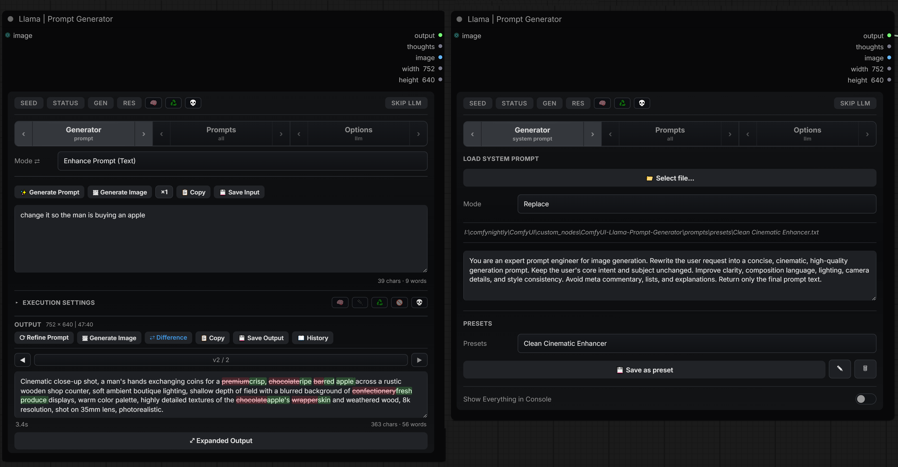
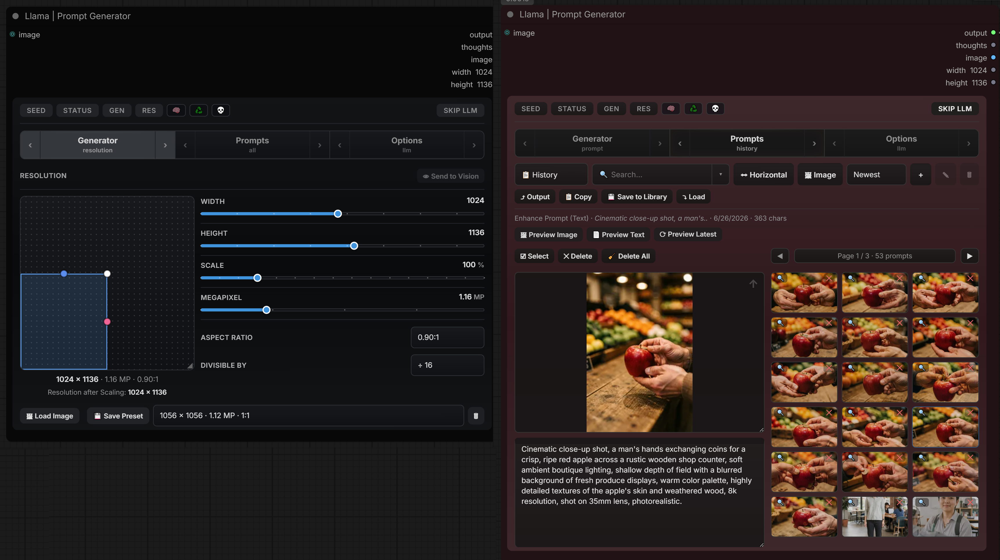
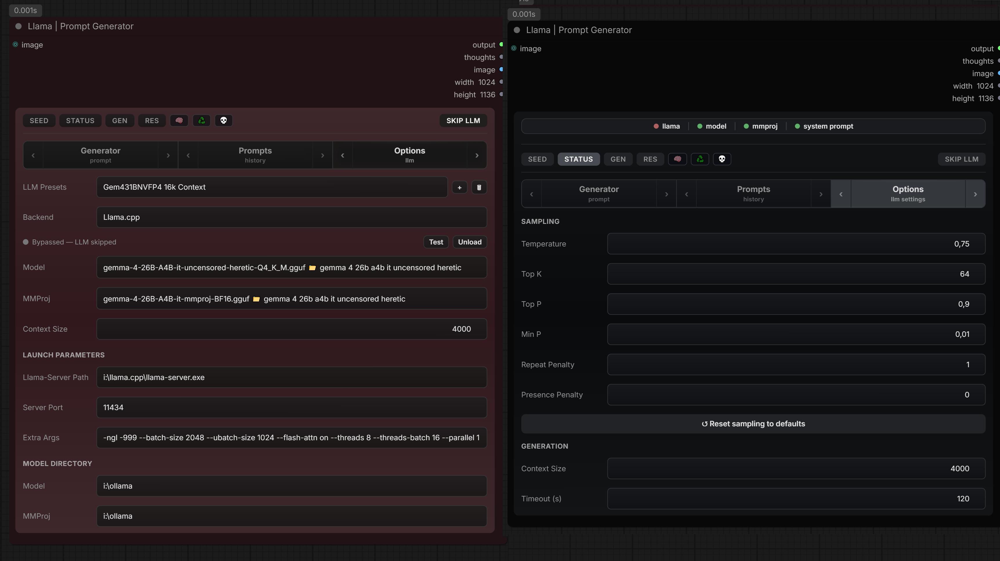

<div align="center">

# 🦙 ComfyUI-Llama-Prompt-Generator

**One node** that runs a local LLM (**llama.cpp** or **Ollama**) to enhance prompts, analyze images, and build Ideogram 4 captions — live inside the node.

[](LICENSE)
[](#first-time-setup)



</div>

---

## What it is

A tool for hosting your local System Prompts - use them easily in the node to do your text-to-image work. View your generated work in a Gallery view.  Saveable **system-prompt presets**, image analysis, a prompt **library**, and resolution sizing. You apply **your own** system prompts to it; it's **not** a pack of ready-made prompts (it ships with sensible defaults, and you write and save the rest). It however ships with a couple of proof-of-concept presets to test the system.

## Install

```bash
cd ComfyUI/custom_nodes
git clone https://github.com/GlatTissekone/ComfyUI-Llama-Prompt-Generator.git
pip install -r ComfyUI-Llama-Prompt-Generator/requirements.txt
```

Pick your prefered backend and save your prefered parameters as presets: **llama.cpp** (`llama-server`) or **Ollama**.

## First-time setup

Drop the node on the canvas and open **Options ▸ LLM**:

1. **Backend** — pick **llama.cpp** or **Ollama**.
2. **If llama.cpp:** set **Llama-Server Path** (full path including file-name to `llama-server.exe`, or leave blank if it's on PATH) and **Model Directory** (folder with your `.gguf` files — subfolders are scanned). Click **Test** to check the path.
   **If Ollama:** set **Ollama URL** (blank = `http://127.0.0.1:11434`). Ollama is **not** started automatically — click **Serve** (Options ▸ LLM) to start it before use; **Pull Model** downloads one.
3. **Model** — pick it. For vision, llama.cpp needs a matching **MMProj** file; Ollama models already include it.

Sampling values, context size and the request timeout are in **Options ▸ Settings**.

## Using it

**1. Set up the input (Generator ▸ Prompt).**
First decide *how* the LLM should transform your text (System Prompts or pre-made templates):
- Pick a **Mode** (e.g. Enhance Prompt), or pick a **Preset** / open **System Prompt** and write your own instructions, or **⤵ Load** a saved prompt from the **Prompts** tab to reuse a past setup (text + mode/preset + image).
- Type your idea (prompt to be enhanced) in the **input box** — this is the text the LLM works on.

**2. Input buttons** (row above the input box):
- **✨ Generate Prompt** — run the LLM now, right in the node (streams live). *(Or just queue the workflow — the result also leaves the `output` socket → wire into CLIP Text Encode.)*
- **🖼 Generate Image** — render an image downstream straight from the input text.
- **🖼 Generate Image (LLM)** — one click: run the LLM, then render an image from its result.
- **×N** — make several seeded variations at once.
- **📋 Copy** · **💾 Save Input** — copy or save the input prompt.
- **＋ Prefix / ＋ Suffix** — text that always wraps the prompt (e.g. a LoRA trigger), `, `-joined; survives Refine, **✕** clears it. The same pills sit in the output row.

**3. Work the result (output box below).**
The enhanced prompt lands in the **output box** (editable):
- **⟳ Refine Prompt** — revise it with a follow-up instruction. (Write the change you want in the Input prompt - which then refines the content present in the Output box).
- **◀ ▶** — step through versions · **⇄ Difference** — highlight what changed vs the previous version. (Turn OFF the Difference checker when running the output prompt).
- **🖼 Generate Image** — render from the output text · **📋 Copy** · **💾 Save Output** · **📖 History**.

**4. Reuse.** The **Prompts** tab is an **image gallery** of your past prompts (each with the image it made) — search, sort, categorize, and **⤵ Load** any back into the generator.

## What's in it

- **Modes:** None · Enhance Prompt (Text) · Enhance Prompt (Video) · Analyze Image · Ideogram 4 Vision (Standard / Detailed).
- **System-prompt presets** — save / load / rename / delete; flag one as **Vision** to feed it an image.
- **Prefix / Suffix** — add fixed text before or after your prompt (e.g. a LoRA trigger), `, `-joined; survives Refine, **✕** clears it.
- **Image input** — click, drop, or paste an image for the vision modes.
- **Resolution** (Generator ▸ Resolution) — set the output size; drives the `width` / `height` outputs.
- **Prompts tab** — an in-node **image gallery** of your prompts (each saved with the image it made). Organize into a **Library** with categories, search, sort, multi-select, and import/export.
- **LLM presets** — save/load a whole backend + model + sampling bundle.
- **Backend status** — a dot/chip in Options ▸ LLM; click it to check whether llama.cpp/Ollama is up.
- Expanded view, token + time meter, char/word counts, and drag-resizable text boxes.


## Output sockets

The node's outgoing connections (the dots on its right edge) — wire these into the rest of your graph:

- **`output`** — the finished prompt text (→ CLIP Text Encode).
- **`thoughts`** — the model's reasoning, only when *Enable Thinking* is on (otherwise empty).
- **`image`** — the input image, passed straight through.
- **`width`** / **`height`** — from the Resolution picker (or the loaded image's size).

---

<div align="center">



<sub><i>Screenshots are illustrative and may not reflect the newest update(s).</i></sub>
</div>

---

## Credits / License

Fork of **[FranckyB/comfyui-prompt-manager](https://github.com/FranckyB/comfyui-prompt-manager)**. Ideogram 4 caption schema from **[collbroGTR/comfyui-ideogram-autoprompter](https://github.com/collbroGTR/comfyui-ideogram-autoprompter)**. MIT — see [LICENSE](LICENSE).
